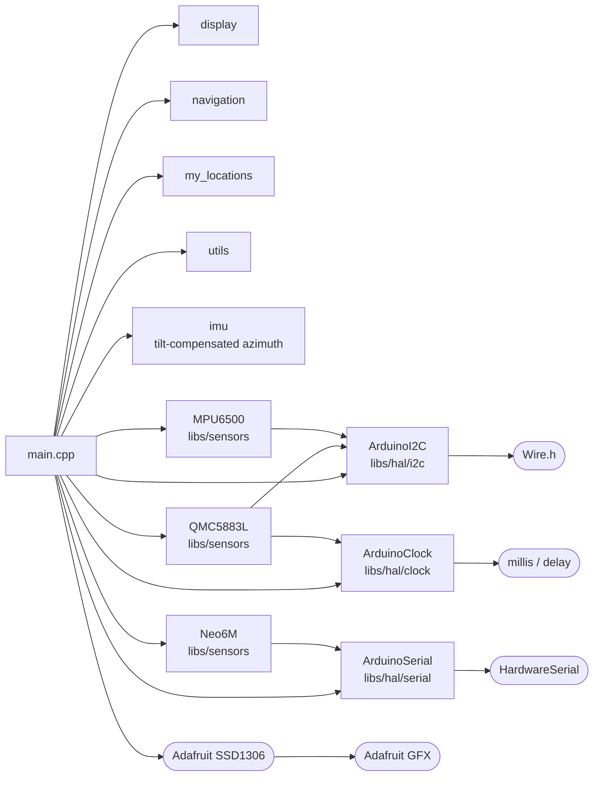

# Beer Compass

A compass built with the Arduino framework that always points to the nearest
liquor store. This app contains the firmware for version 0 of the project,
which uses breakout boards and breadboards. Version 1 will feature a custom PCB
design, but the firmware will remain largely the same since the same ICs will
be used.

This app was imported from the standalone
[beer-compass](https://github.com/kyle-qi/beer-compass) repository, which keeps
the earlier history.

## Getting started

The app is a PlatformIO project inside the `embedded-libraries` monorepo.
`platformio.ini` links the drivers it needs from `libs/` with `symlink://`
entries, so no other repositories need to be cloned.

```bash
# From the repo root
pio run -d apps/beer-compass               # build
pio run -d apps/beer-compass -t upload     # flash
pio device monitor -d apps/beer-compass    # serial monitor at 115200 baud
```

You can also open `apps/beer-compass/` in VS Code with the PlatformIO extension.

## Project architecture

The codebase is split into three responsibility layers:

| Layer | Where it lives |
|---|---|
| Hardware drivers — register maps, I2C/UART comms, raw data conversion | `libs/sensors/`, `libs/hal/`, `libs/core/` |
| Sensor fusion — pitch, roll, yaw, tilt-compensated azimuth | this app (`include/imu.h`, `src/imu.cpp`) |
| Application — UI, navigation, locations, sensor wiring | this app (`src/`, `include/`) |

The tilt-compensated azimuth lives in the app for now. `libs/fusion/nine_dof`
is a work-in-progress Kalman filter that does not provide it yet.

### Dependency graph



`Result<T, Status>` from `libs/core` is used throughout the HAL and driver
layers and is omitted from the graph for readability.

**Shape legend**
- Rectangle — portable logic library (minimal changes when changing targets)
- Rounded rectangle / pill — platform wrapper (requires modification when changing frameworks)

## Hardware

| Component | Interface | Notes |
|---|---|---|
| ESP32 DevKit V1 | — | MCU |
| QMC5883L | I2C (SDA 21, SCL 22) | Magnetometer |
| MPU6500 | I2C (SDA 21, SCL 22) | Accelerometer / gyroscope |
| u-blox NEO-6M | UART (`Serial1`, RX 16, TX 17) | GPS |
| SSD1306 128×64 OLED | I2C (SDA 21, SCL 22) | Display |
